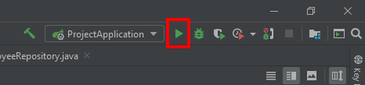

# Sparrista - backend
Created in Spring Boot, with PostgreSQL database.

## Getting started
These instructions will get you a copy of the project up and running on your local machine for development and testing purposes.

### Prerequisites
What things you need to install the software and how to install them.

- Git
- A favorite text editor or IDE (I recommend IntelliJ IDEA)
- [PostgreSQL](https://www.postgresql.org/download/)
- [JDK](http://www.oracle.com/technetwork/java/javase/downloads/index.html) 1.8 or later
- [Gradle](http://www.gradle.org/downloads) 4+ or [Maven](https://maven.apache.org/download.cgi) 3.2+

### Installation
A step by step series of examples that tell you how to get a development env running.

#### Using IntelliJ IDEA

1. Download IntelliJ IDEA and PostgreSQL.

2. Clone repository.
```batch
\> git clone https://github.com/cokolwiek-io/sparrista.git
```

3. Go to project subfolder (\sparrista\backend) and open it in IntelliJ IDEA.

4. Edit ```\sparrista\backend\src\main\resources\application.properties``` file and replace PostgreSQL url, username and password with your configuration.
```properties
spring.datasource.url=jdbc:postgresql://localhost:5432/postgres
spring.datasource.username=postgres
spring.datasource.password=password
```   

5. Wait for dependencies to resolve, then click run button.


---
#### Using Maven

1. Download JDK, Maven and PostgreSQL.

2. Clone repository.
```batch
\> git clone https://github.com/cokolwiek-io/sparrista.git
```

3. Edit ```\sparrista\backend\src\main\resources\application.properties``` file and replace PostgreSQL url, username and password with your configuration.
```properties
spring.datasource.url=jdbc:postgresql://localhost:5432/postgres
spring.datasource.username=postgres
spring.datasource.password=password
```   

4. Go to project subfolder (`\sparrista\backend`) and run:

<b>Windows:</b>
```batch
\sparrista\backend> mvnw spring-boot:run
```

<b>MacOS/Linux:</b>
```batch
\sparrista\backend> ./mvnw spring-boot:run
```
---

#### Test endpoint
In your browser go to http://localhost:8080/api/employees. You should see a response with 17 employees.

## Documentation
We use Swagger 2 as REST API documentation tool.

To view all endpoints go to http://localhost:8080/swagger-ui.html