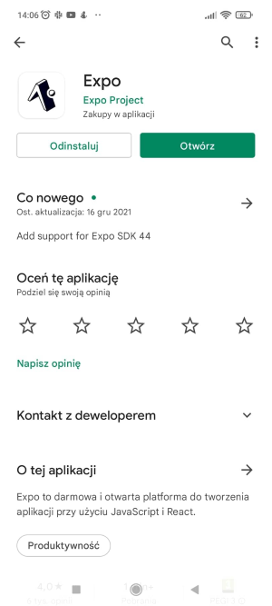
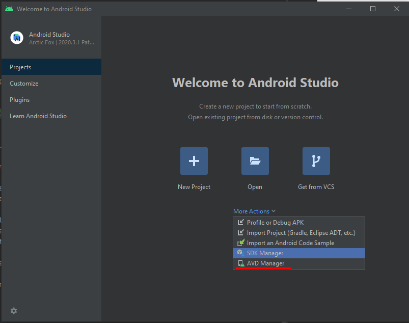
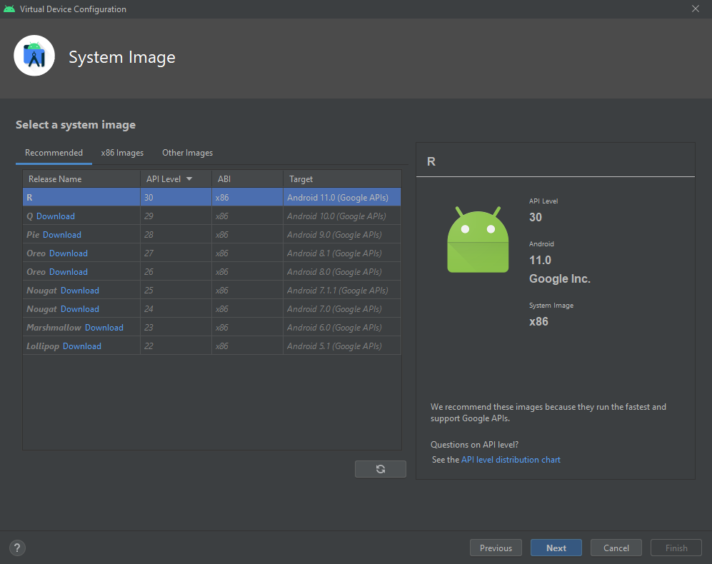

# Sparrista - mobile app
Built with React Native.

## Getting started
These instructions will get you a copy of the project up and running on your local machine for development and testing purposes.

### Prerequisites
What things you need to install the software and how to install them.

- Git
- A favorite text editor or IDE (I recommend [IntelliJ IDEA](https://www.jetbrains.com/idea/))
- [Node.js and npm](https://nodejs.org/en/download/)

### Installation
A step by step series of examples that tell you how to get a development env running.

1. Run this command in order to install Expo CLI command line utility
   ```batch
   \> npm install -g expo-cli
   ```

2. Clone project from git
   ```batch
   \> git clone https://github.com/cokolwiek-io/sparrista.git
   ```

3. Go to project subfolder (\sparrista\app)
   ```batch
   \> cd sparrista/app
   ```

4. Download modules
   ```batch
   \sparrista\app> npm install
   ```

5. Start a development server
   ```batch
   \sparrista\app> npm start
   ```
   or
   ```batch
   \sparrista\app> expo start
   ```

6. Install Expo app from Google Play and connect to the same wireless network as your computer. 
   On Android, use the Expo app to scan the QR code from your terminal to open your project. 
   On iOS, use the built-in QR code scanner of the Camera app.



7. Modify your app. Open `App.js` in your text editor of choice and edit some lines. The application should reload automatically once you save your changes.

### Open the app on emulator

1. Download and install [Android Studio](https://developer.android.com/studio/index.html)
   While on Android Studio installation wizard, make sure the boxes next to all of the following items are checked:
   - Android SDK
   - Android SDK Platform
   - Android Virtual Device
   - If you are not already using Hyper-V: Performance (Intel ® HAXM) ([See here for AMD or Hyper-V](https://android-developers.googleblog.com/2018/07/android-emulator-amd-processor-hyper-v.html))

If the checkboxes are grayed out, you will have a chance to install these components later on.

2. Open Android Studio, click More Actions and select AVD Manager

   
3. Click Create Virtual Device

4. Choose a tablet with Pixel C. Download the newest release, e.g. R (API Level 30).

   
5. Launch your emulator device

6. Start an app on emulator
   ```batch
   \sparrista\app> npm run android
   ```
   
## Authors
- Angelika Iskra
- ... add yourselves here :)